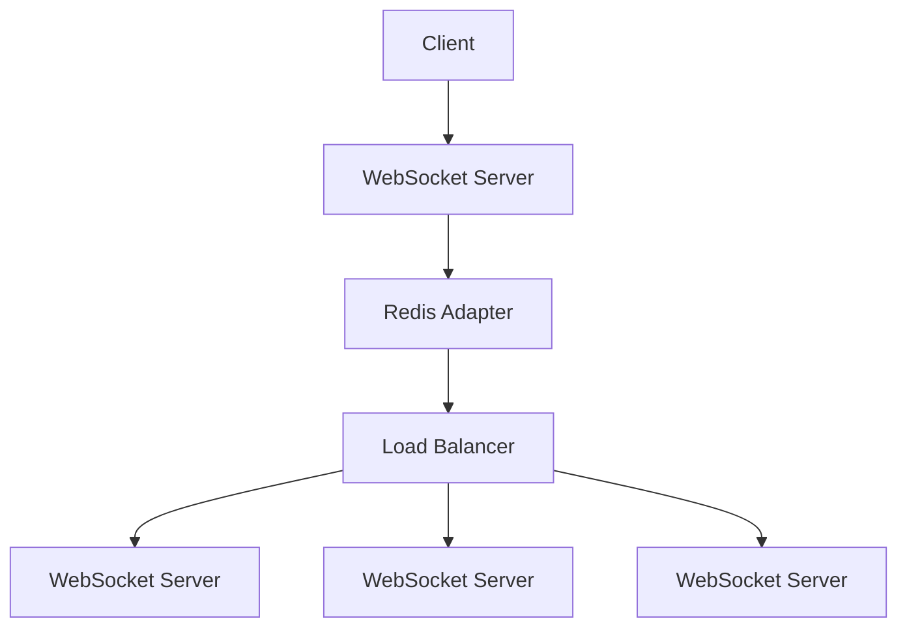

# Real-time Collaboration Features

## Overview

AppScreens provides real-time collaboration features that allow teams to work together on screenshot projects. This document outlines the implementation of these features including real-time updates, sharing mechanisms, and communication tools.

## Architecture

### WebSocket Implementation


### Event System
Real-time features are built on a publish-subscribe event system:
- Events are published to Redis channels
- WebSocket servers subscribe to relevant channels
- Events are broadcast to connected clients

## Features

### 1. Real-time Job Status Updates

#### Event: `job.status.updated`
When a job status changes, all interested parties are notified:
```json
{
  "event": "job.status.updated",
  "data": {
    "jobId": "uuid",
    "status": "completed",
    "updatedAt": "2023-01-01T00:00:00Z"
  }
}
```

#### Implementation
```javascript
// Server-side
io.to(`organization:${organizationId}`).emit('job.status.updated', {
  jobId,
  status,
  updatedAt: new Date()
});

// Client-side
socket.on('job.status.updated', (data) => {
  updateJobStatus(data.jobId, data.status);
});
```

### 2. Job Sharing

#### Share Job
Users can share jobs with team members:
```http
POST /api/v1/jobs/{jobId}/share
{
  "userId": "uuid",
  "permission": "view"
}
```

#### Event: `job.shared`
When a job is shared, the recipient is notified:
```json
{
  "event": "job.shared",
  "data": {
    "jobId": "uuid",
    "sharedBy": {
      "id": "uuid",
      "firstName": "John",
      "lastName": "Doe"
    },
    "permission": "view"
  }
}
```

### 3. Real-time Comments

#### Add Comment
```http
POST /api/v1/jobs/{jobId}/comments
{
  "content": "This looks great!",
  "parentId": "uuid"
}
```

#### Event: `comment.created`
When a comment is added, all users viewing the job are notified:
```json
{
  "event": "comment.created",
  "data": {
    "comment": {
      "id": "uuid",
      "jobId": "uuid",
      "userId": "uuid",
      "content": "This looks great!",
      "createdAt": "2023-01-01T00:00:00Z"
    }
  }
}
```

#### Event: `comment.updated`
When a comment is updated:
```json
{
  "event": "comment.updated",
  "data": {
    "comment": {
      "id": "uuid",
      "content": "This looks great! Updated.",
      "updatedAt": "2023-01-01T00:05:00Z"
    }
  }
}
```

#### Event: `comment.deleted`
When a comment is deleted:
```json
{
  "event": "comment.deleted",
  "data": {
    "commentId": "uuid"
  }
}
```

### 4. Team Presence

#### Event: `user.presence.changed`
When a user's presence changes:
```json
{
  "event": "user.presence.changed",
  "data": {
    "userId": "uuid",
    "organizationId": "uuid",
    "status": "online", // online, offline, away
    "lastSeen": "2023-01-01T00:00:00Z"
  }
}
```

### 5. Real-time Notifications

#### Event: `notification.created`
When a notification is created:
```json
{
  "event": "notification.created",
  "data": {
    "notification": {
      "id": "uuid",
      "type": "job_completed",
      "title": "Job Completed",
      "message": "Your screenshot job has completed",
      "read": false,
      "createdAt": "2023-01-01T00:00:00Z"
    }
  }
}
```

## Implementation Details

### Socket.IO Server Setup
```javascript
const io = require('socket.io')(server, {
  cors: {
    origin: process.env.FRONTEND_URL,
    methods: ['GET', 'POST']
  }
});

// Redis adapter for multi-server support
io.adapter(require('socket.io-redis')({
  host: process.env.REDIS_HOST,
  port: process.env.REDIS_PORT
}));

// Authentication middleware
io.use((socket, next) => {
  const token = socket.handshake.auth.token;
  if (!token) {
    return next(new Error('Authentication error'));
  }
  
  jwt.verify(token, process.env.JWT_SECRET, (err, user) => {
    if (err) return next(new Error('Authentication error'));
    socket.userId = user.id;
    socket.organizationId = user.organizationId;
    next();
  });
});

io.on('connection', (socket) => {
  // Join organization room
  socket.join(`organization:${socket.organizationId}`);
  
  // Join user room
  socket.join(`user:${socket.userId}`);
  
  // Handle disconnection
  socket.on('disconnect', () => {
    // Broadcast user offline status
    socket.to(`organization:${socket.organizationId}`).emit('user.presence.changed', {
      userId: socket.userId,
      organizationId: socket.organizationId,
      status: 'offline',
      lastSeen: new Date()
    });
  });
});
```

### Client-side Implementation
```javascript
// Frontend WebSocket connection
const socket = io(process.env.WEBSOCKET_URL, {
  auth: {
    token: localStorage.getItem('token')
  }
});

// Listen for job status updates
socket.on('job.status.updated', (data) => {
  // Update UI in real-time
  updateJobStatusInUI(data.jobId, data.status);
});

// Listen for new comments
socket.on('comment.created', (data) => {
  // Add comment to UI
  addCommentToUI(data.comment);
});

// Listen for notifications
socket.on('notification.created', (data) => {
  // Show notification
  showNotification(data.notification);
});
```

## Room Management

### Organization Rooms
All users in an organization join a shared room:
```javascript
socket.join(`organization:${organizationId}`);
```

### Job Rooms
Users viewing a specific job join that job's room:
```javascript
socket.join(`job:${jobId}`);
```

### User Rooms
Each user has a personal room for direct messages:
```javascript
socket.join(`user:${userId}`);
```

## Security Considerations

### Authentication
- All WebSocket connections require JWT authentication
- Tokens are verified before allowing connection
- User context is attached to socket for authorization

### Authorization
- Events are only sent to authorized rooms
- Server validates user permissions before broadcasting
- Client-side UI reflects user permissions

### Data Validation
- All incoming data is validated
- Output is sanitized before sending to clients
- Rate limiting prevents abuse

## Scalability

### Horizontal Scaling
- Multiple WebSocket servers behind load balancer
- Redis adapter for message synchronization
- Sticky sessions for WebSocket connections

### Performance Optimization
- Efficient room management
- Event filtering to reduce unnecessary broadcasts
- Compression for large payloads

### Monitoring
- Connection count tracking
- Event throughput monitoring
- Error rate tracking
- Latency measurements

## Error Handling

### Connection Errors
- Automatic reconnection with exponential backoff
- Error notifications to users
- Graceful degradation when real-time features unavailable

### Event Errors
- Validation of incoming events
- Error responses for malformed data
- Logging of failed events for debugging

## Testing

### Unit Tests
- Event emission testing
- Room joining/leaving
- Authentication middleware

### Integration Tests
- End-to-end event flow
- Multi-user scenarios
- Failure recovery

### Load Testing
- Concurrent connection testing
- Event throughput testing
- Memory usage monitoring

## Future Enhancements

### Advanced Features
- Typing indicators
- Read receipts
- Message reactions
- File sharing in comments
- Voice/video calling integration

### Performance Improvements
- Selective event broadcasting
- Client-side event filtering
- Incremental data updates
- Connection pooling