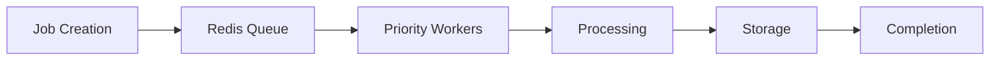

# File Upload and Processing Flow

## Overview

The file upload and processing flow in AppScreens handles the entire lifecycle of screenshot requests, from initial submission through to final delivery. This document details the technical implementation and data flow.

## Upload Process

### 1. Client-side Preparation

When a user submits a screenshot request:
1. The frontend validates the app URL
2. Extracts the app ID from the URL
3. Determines the store type (Google Play or App Store)
4. Sends the request to the backend

### 2. API Request

```http
POST /api/v1/jobs
Content-Type: application/json
Authorization: Bearer <jwt-token>

{
  "app_url": "https://play.google.com/store/apps/details?id=com.example.app",
  "store": "google"
}
```

### 3. Backend Processing

#### Job Creation
1. Validate the request parameters
2. Extract app ID from URL
3. Create a new job record in the database
4. Assign initial status (pending)
5. Add job to processing queue

#### Queue Management
Jobs are managed using a priority queue system:
- Free users: Normal priority
- Pro users: High priority
- Enterprise users: Highest priority
- Scheduled jobs: Priority based on schedule time

### 4. Worker Processing

#### Screenshot Capture
1. Worker dequeues job
2. Updates job status to "processing"
3. Uses appropriate scraper for the store:
   - Google Play: Play Store scraper
   - App Store: iTunes scraper
4. Captures screenshots for all device types
5. Processes images (resize, optimize)
6. Uploads to cloud storage

#### Image Processing
1. Resize images to standard sizes
2. Optimize for web delivery
3. Generate thumbnails
4. Add metadata (dimensions, device type, etc.)

#### Storage
1. Upload processed images to cloud storage (AWS S3)
2. Generate CDN URLs
3. Store metadata in database

### 5. Completion

1. Create ZIP archive of all screenshots
2. Upload ZIP to cloud storage
3. Update job status to "completed"
4. Store result URL in database
5. Send notification to user

## Processing Architecture

### Queue System


### Worker Types
1. **Screenshot Workers**: Handle screenshot capture
2. **Processing Workers**: Handle image processing
3. **Storage Workers**: Handle file uploads
4. **Notification Workers**: Handle user notifications

### Retry Logic
- Failed jobs are retried up to 3 times
- Exponential backoff between retries
- After 3 failures, job marked as "failed"
- Admins can manually retry failed jobs

## File Storage Structure

### Organization-based Storage
```
s3://appscreens-screenshots/
├── {organization-id}/
│   ├── {job-id}/
│   │   ├── screenshots/
│   │   │   ├── mobile-portrait-1.png
│   │   │   ├── mobile-portrait-2.png
│   │   │   ├── tablet-landscape-1.png
│   │   │   └── ...
│   │   └── screenshots.zip
│   └── ...
└── ...
```

### CDN Integration
- All files served through CDN
- Custom domain support for enterprise customers
- Automatic SSL certificate management
- Cache invalidation on updates

## Processing Pipeline

### Step 1: Validation
```javascript
// Validate app URL
if (!isValidAppUrl(appUrl)) {
  throw new ValidationError('Invalid app URL');
}

// Extract app ID
const appId = extractAppId(appUrl);
```

### Step 2: Job Creation
```javascript
const job = await Job.create({
  appId,
  appUrl,
  store,
  organizationId,
  createdBy: userId,
  status: 'pending'
});
```

### Step 3: Queue Submission
```javascript
await queue.add('screenshot-job', {
  jobId: job.id,
  priority: getUserPriority(userId)
}, {
  jobId: job.id,
  priority: getUserPriority(userId)
});
```

### Step 4: Worker Processing
```javascript
async function processJob(jobData) {
  const { jobId } = jobData;
  
  // Update status
  await Job.update(jobId, { status: 'processing' });
  
  try {
    // Capture screenshots
    const screenshots = await captureScreenshots(jobId);
    
    // Process images
    const processed = await processImages(screenshots);
    
    // Upload to storage
    const urls = await uploadToStorage(processed);
    
    // Create ZIP
    const zipUrl = await createZipArchive(urls);
    
    // Complete job
    await Job.update(jobId, {
      status: 'completed',
      resultUrl: zipUrl,
      completedAt: new Date()
    });
    
    // Notify user
    await sendNotification(jobId);
  } catch (error) {
    await Job.update(jobId, {
      status: 'failed',
      errorMessage: error.message
    });
    
    throw error;
  }
}
```

## Performance Optimization

### Parallel Processing
- Multiple screenshots captured simultaneously
- Image processing done in parallel
- Uploads happen concurrently

### Caching
- Frequently accessed apps cached
- Pre-rendered templates for common operations
- CDN caching for static assets

### Resource Management
- Dynamic worker scaling based on queue size
- Memory and CPU monitoring
- Automatic cleanup of temporary files

## Error Handling

### Common Errors
1. **Invalid URL**: App URL doesn't match expected format
2. **App Not Found**: App doesn't exist in store
3. **Store Unavailable**: Store API is down
4. **Processing Error**: Image processing failed
5. **Storage Error**: Upload to cloud storage failed

### Recovery Mechanisms
- Automatic retries for transient errors
- Manual intervention for persistent errors
- User notifications for failed jobs
- Admin dashboard for monitoring

## Monitoring and Metrics

### Key Metrics
- Job processing time
- Success/failure rates
- Queue depths
- Resource utilization
- User wait times

### Alerting
- Queue depth thresholds
- Processing time SLAs
- Error rate thresholds
- System health checks

## Security Considerations

### File Validation
- File type validation
- Size limits
- Malware scanning
- Content moderation

### Access Control
- Signed URLs for temporary access
- Role-based access control
- Organization isolation
- Audit logging

### Data Protection
- Encryption at rest
- Encryption in transit
- Regular security scans
- Compliance with data protection regulations