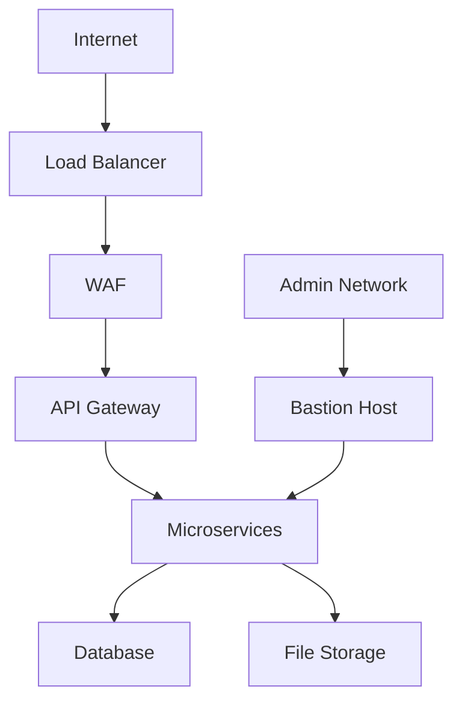

# Security Implementation Plan

## Overview

This document outlines the comprehensive security implementation plan for AppScreens, covering authentication, authorization, data protection, network security, and compliance measures.

## Authentication

### User Authentication

#### Multi-factor Authentication (MFA)
- TOTP-based 2FA using authenticator apps
- SMS-based 2FA as fallback
- Security keys support (WebAuthn)
- Recovery codes for account access

#### Password Security
- Minimum 12 characters with complexity requirements
- Password strength meter during registration
- bcrypt with salt rounds >= 12
- Password history to prevent reuse
- Expiration policy (90 days)

#### Session Management
- JWT tokens with 15-minute expiration
- Refresh tokens with 7-day expiration
- Token rotation on each refresh
- Immediate invalidation on logout
- Device fingerprinting for session binding

#### Single Sign-On (SSO)
- SAML 2.0 integration
- OAuth 2.0 providers (Google, Microsoft)
- OpenID Connect support
- Just-in-time provisioning

### API Authentication

#### Token-based Authentication
- JWT for stateless authentication
- HMAC for request signing
- API keys for service-to-service communication
- Rate limiting per token

#### Token Security
```javascript
// JWT payload structure
{
  "sub": "user-id",
  "org": "organization-id",
  "iat": 1516239022,
  "exp": 1516242622,
  "scp": ["read:jobs", "write:jobs"],
  "jti": "unique-jwt-id"
}
```

## Authorization

### Role-Based Access Control (RBAC)

#### Roles
1. **Owner**: Full access to organization
2. **Admin**: Manage users, billing, settings
3. **Developer**: Create and manage jobs
4. **Viewer**: View jobs and screenshots
5. **Guest**: Limited access (invited users)

#### Permissions Matrix
| Feature | Owner | Admin | Developer | Viewer | Guest |
|---------|-------|-------|-----------|--------|-------|
| Create Jobs | ✓ | ✓ | ✓ | | |
| Edit Jobs | ✓ | ✓ | ✓ | | |
| Delete Jobs | ✓ | ✓ | ✓ | | |
| View Jobs | ✓ | ✓ | ✓ | ✓ | ✓ |
| Share Jobs | ✓ | ✓ | ✓ | ✓ | |
| Manage Users | ✓ | ✓ | | | |
| Manage Billing | ✓ | ✓ | | | |
| Manage Settings | ✓ | ✓ | | | |

### Attribute-Based Access Control (ABAC)
- Time-based access restrictions
- IP-based access controls
- Device-based restrictions
- Geographic restrictions

### Resource-Level Permissions
- Fine-grained access to specific jobs
- Team-based access controls
- Project-based permissions
- Folder/document-level permissions

## Data Protection

### Encryption

#### At Rest
- AES-256 encryption for all stored data
- Database encryption at rest
- File storage encryption
- Key management with AWS KMS/HSM

#### In Transit
- TLS 1.3 for all communications
- Strict transport security (HSTS)
- Certificate pinning for mobile apps
- Mutual TLS for service-to-service

#### Key Management
```javascript
// Key rotation policy
const keyRotationPolicy = {
  masterKeyRotation: 'annual',
  dataKeyRotation: 'monthly',
  keyUsageTracking: true,
  keyAccessLogging: true
};
```

### Data Privacy

#### Personal Data Handling
- GDPR compliance
- CCPA compliance
- Data minimization principles
- Right to erasure implementation

#### Data Classification
- Public: Non-sensitive data
- Internal: Company internal data
- Confidential: Customer data
- Restricted: Highly sensitive data

### Data Loss Prevention (DLP)
- Content inspection for sensitive data
- Data egress monitoring
- Automated incident response
- Compliance reporting

## Network Security

### Firewall Configuration
- Whitelist known IP ranges
- Block known malicious IPs
- Rate limiting at network level
- Geographic IP filtering

### DDoS Protection
- Rate limiting
- Request throttling
- Traffic shaping
- CDN-based DDoS mitigation

### Intrusion Detection
- Network-based IDS
- Host-based IDS
- Behavioral anomaly detection
- Real-time alerting

### Secure Network Architecture


## Application Security

### Input Validation
- Strict input validation on all endpoints
- Output encoding to prevent XSS
- SQL injection prevention with parameterized queries
- File upload validation and sanitization

### Secure Coding Practices
- Static application security testing (SAST)
- Dynamic application security testing (DAST)
- Dependency vulnerability scanning
- Security-focused code reviews

### Error Handling
- Generic error messages for users
- Detailed error logging for developers
- No sensitive data in error responses
- Rate limiting for error responses

## Compliance

### Regulatory Compliance

#### GDPR
- Data processing agreements
- Privacy by design
- Data subject rights implementation
- Breach notification procedures

#### SOC 2
- Security policies and procedures
- System monitoring and logging
- Incident response procedures
- Change management processes

#### HIPAA (if applicable)
- Business associate agreements
- Protected health information safeguards
- Audit controls
- Transmission security

### Industry Standards

#### ISO 27001
- Information security management system
- Risk assessment and treatment
- Statement of applicability
- Continuous improvement

#### NIST Cybersecurity Framework
- Identify
- Protect
- Detect
- Respond
- Recover

## Monitoring and Logging

### Security Monitoring
- Real-time threat detection
- User behavior analytics
- Log aggregation and analysis
- Security information and event management (SIEM)

### Audit Logging
```javascript
// Audit log structure
const auditLog = {
  timestamp: new Date().toISOString(),
  userId: 'user-id',
  organizationId: 'org-id',
  action: 'job.created',
  resource: 'job-id',
  ipAddress: '192.168.1.1',
  userAgent: 'Mozilla/5.0...',
  result: 'success',
  details: {
    appId: 'com.example.app',
    store: 'google'
  }
};
```

### Incident Response
- 24/7 security monitoring
- Incident response team
- Escalation procedures
- Post-incident analysis

## Vulnerability Management

### Continuous Scanning
- Automated vulnerability scanning
- Penetration testing (quarterly)
- Bug bounty program
- Third-party security assessments

### Patch Management
- Automated dependency updates
- Security patch prioritization
- Testing procedures for patches
- Rollback procedures

## Physical Security

### Data Centers
- SSAE 18 SOC 2 certified facilities
- Biometric access controls
- 24/7 security personnel
- Environmental monitoring

### Device Security
- Full disk encryption for all devices
- Remote wipe capabilities
- Device management policies
- Secure disposal procedures

## Training and Awareness

### Employee Training
- Security awareness training (quarterly)
- Phishing simulation exercises
- Role-specific security training
- Incident response training

### Security Culture
- Security champions program
- Bug bounty incentives
- Security-focused hiring practices
- Continuous education

## Business Continuity

### Disaster Recovery
- Backup and restore procedures
- Business continuity planning
- Recovery time objectives (RTO)
- Recovery point objectives (RPO)

### Incident Response Plan
- Incident classification
- Response procedures
- Communication plan
- Post-incident review

## Third-Party Security

### Vendor Assessment
- Security questionnaires
- Third-party audits
- Contractual security requirements
- Ongoing monitoring

### Supply Chain Security
- Dependency vulnerability scanning
- Software bill of materials (SBOM)
- Secure development practices
- Code signing and verification

## Future Enhancements

### Zero Trust Architecture
- Continuous verification
- Least privilege access
- Micro-segmentation
- Device trust assessment

### Advanced Threat Protection
- Machine learning-based threat detection
- Behavioral analytics
- Deception technology
- Threat intelligence integration

### Quantum-Resistant Cryptography
- Post-quantum cryptography research
- Migration planning
- Hybrid cryptographic systems
- Key management evolution